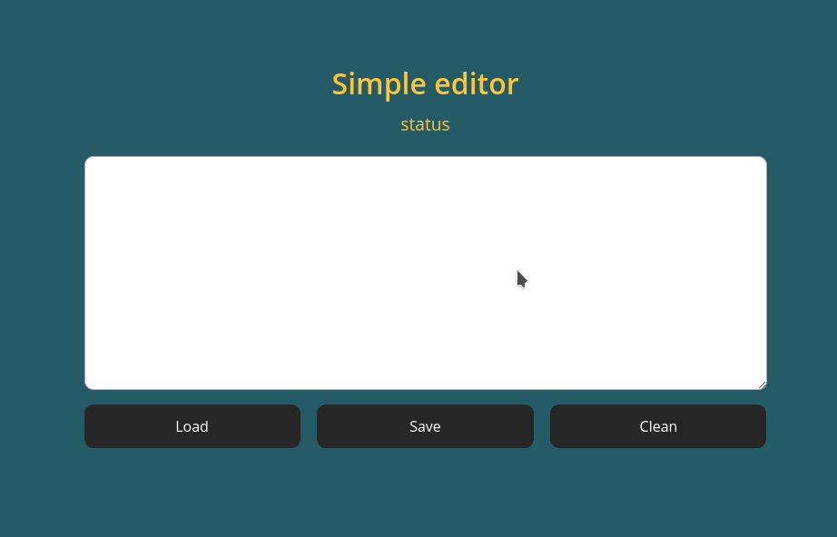

# Simple editor

## Opis projektu
Prosty edytor, którym możemy zapisać, odczytać oraz skasować dane z localStorage.
## Technologie
- HTML5
- CSS
- JavaScript
### Efekt przycisku "Clean"
Efekt zniekształcania przycisku uzyskałem stosując filtr SVG. Stan filtra modyfikowany jest JavaScriptem.
#### Projekt z kórego czerpałem inspiracje oraz kod
1. [DistortedButtonEffects](https://tympanus.net/codrops/2016/05/11/distorted-button-effects-with-svg-filters/)
2. [GitHub](https://github.com/codrops/DistortedButtonEffects/)
## Metodologie użyte w projekcie
- BEM
- SASS (składnia SCSS)
## Automatyzacja
### WTF gulp starter kit
- live server
- kompilacja SASS do CSS
- minifikacja
- dodanie prefiksów
- publikacja strony na github pages
#### Instalacja projektu

`npm install -g gulp-cli`

`npm install`

#### Użycie

`gulp`

Publikacja edytora na github pages `npm run deploy`

[Simple editor](https://andrzej-jablonski-project.github.io/simple-editor/)

